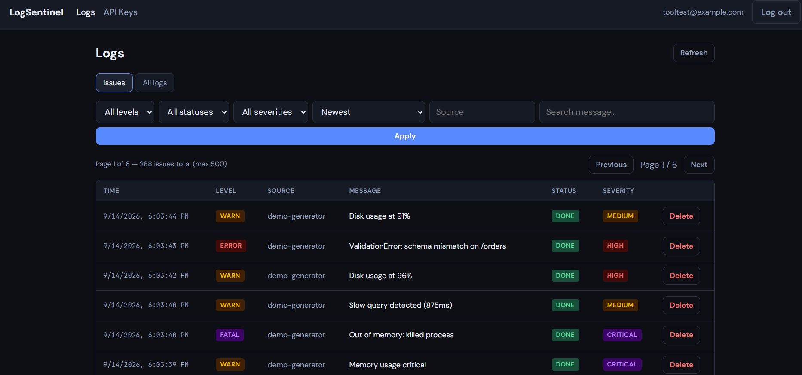

# LogSentinel

AI-powered log analysis — ingest logs, batch-analyze with Claude, view insights in the dashboard.



## Services

Apps send logs with an **API key**; the **worker** batches them and calls Claude once per batch; the **dashboard** reads results from the **API**. MongoDB stores logs and analysis; Redis holds the job queue.

```
apps ──POST /logs/ingest──► api ◄──read/write──► MongoDB
dashboard ──JWT──► api
                    │
                    ▼ Redis queue ──► worker ──batched──► Claude
                                         └──► MongoDB
```

| Directory | Description |
|-----------|-------------|
| `api/` | REST API, auth, log ingestion, paginated `GET /logs` |
| `worker/` | Redis consumer, batched Claude analysis, webhooks |
| `frontend/` | React dashboard (Day 5) |

See [CONTEXT.md](./CONTEXT.md) for product vision, example logs, and dashboard plan.

## Local development

1. Copy `.env.example` to `.env` and fill in values.
2. Start the stack: `docker compose up --build`
3. See [CONTEXT.md](./CONTEXT.md) for architecture and session context.
4. See [DECISIONS.md](./DECISIONS.md) for architecture decisions and problem log.

## Deployment

Live: frontend on Vercel, `api`/`worker` on Fly.io, MongoDB Atlas, Upstash Redis. See [DEPLOYMENT.md](./DEPLOYMENT.md) for setup steps.

### Public demo mode (off by default)

Set `DEMO_MODE=true` (API) and `VITE_DEMO_MODE=true` (frontend) to enable a no-registration public demo — any visitor gets auto-logged into a shared demo account and can click "Regenerate demo logs" to populate it with pre-written (zero-Claude-cost) sample data. Off by default; the real product (real accounts, API keys, live Claude analysis) works the same either way. See `DECISIONS.md` and `CONTEXT.md` for details.

## Tools

Local dev/demo utilities in [`tools/`](./tools) — not part of the deployed stack, run against a running API:

- `node tools/log-shipper.js --key <apiKey> -- node myapp.js` — wraps any command, streams its output to your terminal unchanged, and ships each line to the API live.
- `node tools/demo-log-generator.js --key <apiKey>` — generates realistic synthetic traffic (a configurable mix of routine noise and warn/error/fatal "issues") to populate the dashboard for demos, local or deployed.

See [tools/README.md](./tools/README.md) for full usage.

## Tests

No Docker or API keys required for unit tests (in-memory MongoDB; Redis and Claude mocked).

```bash
cd api && npm install && npm test
cd ../worker && npm install && npm test
```

CI (`.github/workflows/ci.yml`, on push/PR to `main`) runs `api` + `worker` tests, builds the `frontend`, and syntax-checks the `tools/` scripts.

## Status

- **Day 1–2:** Scaffold + API service. See [api/README.md](./api/README.md).
- **Day 3:** Worker (Redis consumer, Claude, notifications). See [worker/README.md](./worker/README.md).
- **Day 4:** Batch AI analysis; MCP removed; API log read endpoints. See [worker/README.md](./worker/README.md).
- **Tests:** API + worker unit tests + CI (Day 6 plan not closed).
- **Day 5:** React dashboard. See [frontend/README.md](./frontend/README.md).
- **Day 5 follow-ups:** `tools/` (log-shipper, demo-log-generator), `GET /logs` pagination, worker `max_tokens` fix, CI now builds the frontend and checks `tools/`. See [CONTEXT.md](./CONTEXT.md) for details.
- **Day 7:** Deployed (Vercel + Fly.io + Atlas + Upstash); fixed a cross-domain auth cookie bug found during deploy; added off-by-default `DEMO_MODE` public demo.
- **Next:** Day 6 — frontend still has no test suite; Day 7 — turn on `DEMO_MODE` for the deployed instance when ready.
